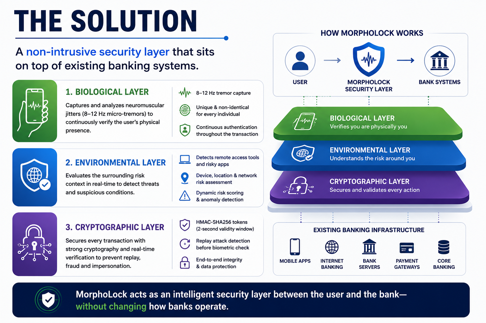

  

 

୨୧　☁️　✦　🦋　✦　🌷　✦　🦋　✦　☁️　୨୧

  

 

☁︎ ˚₊‧ ✦ ‧₊˚ ୨୧ ˚₊‧ ✦ ‧₊˚ ☁︎

---

## ୨୧ Hello!

Hi, I'm **Katyayani Roy** 🌷

I'm a **CSE student specializing in Health Informatics**, curious about the intersection of technology, healthcare and intelligent systems.

I enjoy building things that combine:

**🤖 AI · 🩺 Healthcare · 🛡️ Cybersecurity · ⚙️ IoT**

I'm especially interested in turning interesting ideas into actual projects, experiments and hackathon builds.

> curious mind • creative builder • professional overthinker ♡

☁︎　✦　୨୧　🦋　୨୧　✦　☁︎

---
---

## ✦ Things I'm Building

### 🧬 MorphoLock

**Behavioural Biometrics × AI × Cybersecurity**

A continuous authentication concept using behavioural micro-tremor patterns to detect anomalous activity.

`Python` `Machine Learning` `FFT` `Signal Processing` `Isolation Forest` `Arduino`

---

### 🌐 KRYPTIQ

**3D Security Digital Twin**

A visual cybersecurity environment for exploring network attacks, vulnerabilities and threat propagation.

`Python` `FastAPI` `NetworkX` `React` `3D`

---

### 🩺 AI × Healthcare

Exploring intelligent healthcare systems involving:

`EHR` · `CDSS` · `Healthcare Analytics` · `Medical IoT` · `Digital Health`

---

## 🦋 Currently Exploring

`AI Agents` · `Machine Learning` · `Cybersecurity`

`Healthcare AI` · `Open Source` · `System Design`

`IoT` · `Data Analytics` · `Intelligent Systems`

 

˚₊‧꒰ა ♡ ໒꒱ ‧₊˚

---

## 🎪 Beyond Code

Technology isn't just about writing code.

I also enjoy:

🎯 **Recruitment & HR**

👥 **Team Coordination**

🎤 **Technical Events**

💡 **Hackathons**

📢 **Community Building**

🤝 **Collaboration**

I love watching an idea go from:

**idea → team → chaos → building → debugging → demo ✨**

☁︎　୨୧　✦　🐾　✦　୨୧　☁︎

---

## ⚙️ My Tech Shelf

### Languages

`Python` · `C++` · `Java` · `JavaScript` · `TypeScript`

### Development

`React` · `FastAPI` · `Node.js` · `Git` · `GitHub`

### AI & Data

`Machine Learning` · `TensorFlow` · `Data Analytics` · `Signal Processing`

### Hardware & IoT

`Arduino` · `IoT` · `Sensors` · `Embedded Systems`

### Healthcare

`EHR` · `HL7/FHIR` · `DICOM` · `SNOMED CT` · `LOINC` · `ICD`

---

## 💌 Let's Connect ♡

I'd love to connect, collaborate, build something fun, or simply talk about technology and ideas! 🌷

💙 **LinkedIn**

<https://www.linkedin.com/in/katyayani-roy-b500lb3399>

💌 **Gmail**

<mailto:kirtir729@gmail.com>

---

୨୧　☁️　🦋　♡　🌷　♡　🦋　☁️　୨୧

☁︎　✦　🌷　✦　🦋　✦　୨୧　✦　🐾　✦　☁︎

<i>always building something interesting ✦</i>

  

🦋 ˚₊‧ 🐾 ‧₊˚ 🦋

